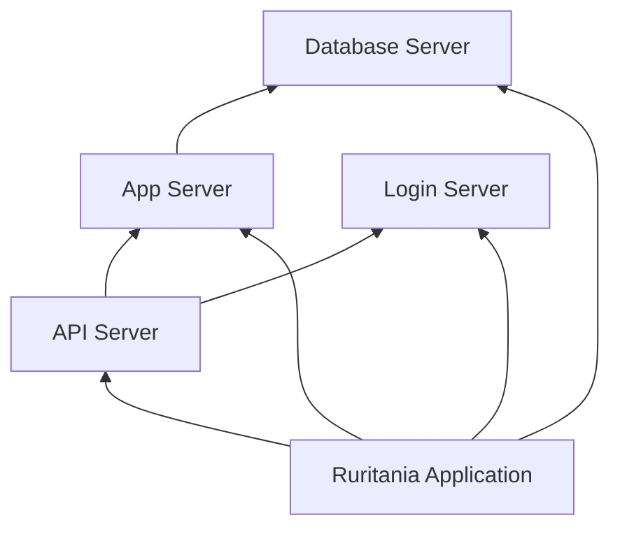

# ITSI POC SE Enablement Lab — Revised Lab Guide

**Version:** 2.1 (July 2026)  
**Scenario:** Ruritania Application monitoring  
**ITSI version:** 4.21.x | **Splunk:** 9.4.x  

This guide supersedes the Oct 2025 SE Enablement Lab document. All steps use the **Splunk Web UI only** — no scripts, REST API, or local files required.

---

## Lab outcomes

By the end of this lab you will:

1. Model Ruritania application hosts as ITSI entities
2. Build a 5-service dependency tree with KPIs
3. Configure thresholds, alerts, and episodes
4. Build a **Ruritania App Glass Table** single pane of glass
5. Deliver the Exercise 8 demo talk track

**Estimated time:** 2–3 hours

---

## Before you start

### Access

| Item | Value |
|------|--------|
| Splunk Web UI | URL from your Splunk Show credentials file |
| Username / password | Values from the same credentials file |

Log in and confirm you can open **IT Service Intelligence** from the Apps menu.

### Prerequisites (Exercise 1)

- ITSI app installed
- Splunk Add-on for Unix/Linux (`Splunk_TA_nix`)
- ITSI Content Pack for Unix/Nix (`DA-ITSI-CP-nix`)
- ITSI Content Pack for Monitoring and Alerting (`DA-ITSI-CP-monitoring-alerting`)
- Datagen running — verify with Search: `index=rur_apps | head 10`

---

## Reference — Ruritania data model

Keep this table open while you work. **Do not** use conflicting values from the original Oct 2025 guide.

| Topic | Use this | Original guide mistake |
|-------|----------|------------------------|
| Application index | `index=rur_apps` | `index=rur_applications` |
| Host names | `api-01`, `login-01`, `app-01`, `db-01` | Implied `-rur` suffix |
| In-scope hosts | **14** (4 API, 4 login, 3 app, 3 db) | Stated as ~20 |
| Sourcetypes | `rur_api`, `rur_login`, `rur_db`, `rur_submission` | `rur:api` style |
| App latency | `sourcetype=rur_submission` | Missing sourcetype filter |
| Latency fields | `response_time_ms`, `duration_ms`, `processing_time_ms` | — |
| Errors | `status>=400 OR isnotnull(error)` | `status=ERROR` (does not exist) |
| OS KPIs in demo | **Not populated** for Ruritania hosts | Assumed nix metrics exist |
| Correlation search | `Service Monitoring - KPI Degraded` | Wrong punctuation/spacing |

---

## Exercise 1 — Explore the environment

**Goal:** Confirm the lab environment is ready.

1. Open **Apps** and verify the prerequisite apps listed above are installed.
2. Open **Search & Reporting** and run:

```spl
| tstats count where index=rur_apps by sourcetype
```

3. Open **ITSI** → **Configuration** → **Entity Types** and confirm *nix entity types exist from the content pack.

**Pass:** `rur_apps` returns counts for `rur_api`, `rur_login`, `rur_db`, and/or `rur_submission`.

---

## Exercise 2 — Review data for ITSI relevance

**Goal:** Understand what data drives entities, KPIs, and episodes.

| Data | Where | ITSI use |
|------|-------|----------|
| Transaction logs | `index=rur_apps` | Custom KPIs |
| Hardware metadata | `index=os` sourcetype `hardware_events` | Entity fields |
| KPI summaries | `index=itsi_summary` | Glass table KPI tiles |
| Episodes | `index=itsi_grouped_alerts` | Glass table episode column |

**Inspect a sample event:**

```spl
index=rur_apps sourcetype=rur_api | head 1 | table _time host response_time_ms status error
```

Note that `status` is numeric (401, 500, 504, etc.) — not the string `ERROR`.

**List in-scope hosts:**

```spl
index=rur_apps | stats count by host | sort host
```

Expected: `api-01`–`api-04`, `login-01`–`login-04`, `app-01`–`app-03`, `db-01`–`db-03`.

---

## Exercise 3 — Configure entities

**Goal:** Create a Ruritania entity type and assign it to the 14 application hosts.

### Step 1 — Create entity type

1. **ITSI** → **Configuration** → **Entity Types** → **Create Entity Type**
2. **Title:** `Ruritania Application Server`
3. **Save**

### Step 2 — Enrich entities with hardware metadata

1. In **Search**, run:

```spl
index=os sourcetype="hardware_events" [ search index=rur_apps | fields host ]
| dedup hostname
| rename hostname as Entity_Title, entity_description AS description
| table Entity_Title, description, platform_type, cpu_model, cpu_cores, disk_drives, region
```

2. Click **Export** → **CSV** (all fields).
3. **ITSI** → **Configuration** → **Entities** → **Import Entities**
4. Upload the CSV. Map columns:
   - `Entity_Title` → Entity title
   - `description`, `platform_type`, `cpu_model`, `cpu_cores`, `disk_drives`, `region` → Informational fields
5. Complete the import wizard.

> If import is unavailable, open each entity manually under **Configuration → Entities**, add the informational fields, and assign the entity type in Step 3.

### Step 3 — Assign Ruritania entity type

**Option A — Bulk edit (fastest):**

1. **Configuration** → **Entities**
2. Filter or search for hosts matching `api-*`, `login-*`, `app-*`, `db-*`
3. Select all 14 in-scope hosts → **Edit**
4. Add entity type **Ruritania Application Server**
5. **Save**

**Option B — Per entity:**

1. Open each entity → **Entity Type** → add **Ruritania Application Server**
2. Confirm the identifier includes field `host`

**Pass:** Filtering entities by **Ruritania Application Server** shows **14 hosts** with hardware metadata.

---

## Exercise 4 — Build service maps

**Goal:** Create the service tree, link the nix KPI template, and add latency KPIs.

### Step 1 — Create services (in this order)

**ITSI** → **Configuration** → **Services** → **Create Service**

| Service | Depends on |
|---------|------------|
| Database Server | *(none)* |
| Login Server | *(none)* |
| App Server | Database Server |
| API Server | Login Server, App Server |
| Ruritania Application | All four tier services |

For each service:

1. Enter **Title** and **Description**
2. On **Dependencies**, add the services from the table
3. **Save**

### Step 2 — Entity rules (tier services only)

Open **Database Server**, **Login Server**, **App Server**, and **API Server**. On the **Entities** tab, add **two** rules:

| Rule | Field | Match type | Value |
|------|-------|------------|-------|
| 1 | Entity type | matches | Ruritania Application Server |
| 2 | Title | matches | `db*` / `login*` / `app*` / `api*` |

Save each service. Confirm the expected entity count (3 db, 4 login, 3 app, 4 api).

### Step 3 — Link OS KPI template (optional)

On each tier service → **Settings** → **Service Templates** → add **OS KPIs - *nix (SAI)**.

> **Important:** Ruritania hosts in Splunk Show do not receive nix `mstats` data. OS KPIs will stay grey. You will use **error KPIs** on the glass table in Exercises 5 and 7 instead.

### Step 4 — Create custom latency KPIs

On each tier service → **KPIs** → **Create KPI** → **New Ad hoc KPI**.

**Common settings for all four KPIs:**

| Setting | Value |
|---------|--------|
| Entity split | Enabled |
| Entity field | `host` |
| Aggregate statistic | Average |
| Entity statistic | Average |
| Threshold field | `value` |
| Unit | `ms` |
| Alert on | Both |

**Paste the search for each service:**

| Service | KPI name | Search |
|---------|----------|--------|
| API Server | API Response Time | `index=rur_apps host=api* \| stats avg(response_time_ms) as value by host` |
| Login Server | Login Duration | `index=rur_apps host=login* \| stats avg(duration_ms) as value by host` |
| App Server | App Processing Time | `index=rur_apps sourcetype=rur_submission host=app* \| stats avg(processing_time_ms) as value by host` |
| Database Server | DB Query Duration | `index=rur_apps host=db* \| stats avg(duration_ms) as value by host` |

Use **Preview** to confirm results, then **Save** each KPI.

> **Critical:** Every search must end with `by host`. Without entity breakdown, KPI tiles stay grey (N/A).

Enable each service when finished (**Settings** → **Enabled**).

**Pass:** Preview shows average latency values roughly 400–800 ms per host.

---

## Exercise 5 — KPI thresholds, error KPIs, and backfill

**Goal:** Color-coded KPIs and enough history to populate the glass table.

### Step 1 — Latency thresholds

For each latency KPI (API Response Time, Login Duration, App Processing Time, DB Query Duration):

1. Open the KPI → **Thresholds** tab
2. Choose **Static thresholds**
3. Set direction: **Increase is worse**
4. Configure levels:

| Severity | Threshold |
|----------|-----------|
| Normal | &lt; 400 |
| Low | 400 |
| Medium | 800 |
| High | 1200 |

5. **Save** the service

### Step 2 — Error KPIs (glass table columns 2 and 3)

On each tier service, create **two** additional ad hoc KPIs.

**KPI A — Error count** (name examples: `API Error Count`, `Login Error Count`, etc.)

| Setting | Value |
|---------|--------|
| Entity split | Enabled — field `host` |
| Threshold field | `value` |
| Unit | `events` |
| Aggregate / entity stat | Sum |

Search (replace prefix per tier):

```spl
index=rur_apps host=<prefix>* (status>=400 OR isnotnull(error)) | stats count as value by host
```

**KPI B — Error rate %** (name examples: `API Error Rate %`, etc.)

| Setting | Value |
|---------|--------|
| Entity split | Enabled — field `host` |
| Threshold field | `value` |
| Unit | `%` |
| Aggregate / entity stat | Average |

Search:

```spl
index=rur_apps host=<prefix>*
| stats count as total count(eval(status>=400 OR isnotnull(error))) as errors by host
| eval value=if(total=0, 0, round(100*errors/total, 2))
```

Use `<prefix>` = `api`, `login`, `app`, or `db`.

**Suggested error-rate thresholds:** normal &lt; 2, low 2, medium 5, high 10.

**Suggested error-count thresholds:** normal &lt; 50, low 50, medium 150, high 300 (adjust after preview if needed).

### Step 3 — KPI backfill

For **each** custom KPI on all five services:

1. Open the KPI → **Settings** (or service **Settings** tab)
2. Enable **Backfill**
3. Select **Last 1 day**
4. **Save** the service

Then enable **Service Health Score backfill** on each of the five services:

1. Open service → **Settings** tab
2. Under **Service Health Score**, enable **Backfill** → **Last 1 day**
3. **Save**

> Backfill runs in the background. Allow **5–15 minutes** before checking the glass table.

**Pass:** In Search, run (replace with your KPI after it collects):

```spl
index=itsi_summary earliest=-4h kpiid=*API*
| stats latest(alert_value) latest(alert_color) by kpiid
```

Values should be numeric; colors should not be grey (`#CCCCCC`).

---

## Exercise 6 — Alerts and episodes

**Goal:** Generate episodes from KPI degradation and application errors.

### Step 1 — Enable correlation searches

**ITSI** → **Configuration** → **Event Management** → **Correlation Searches**

Enable these built-in searches (use exact names):

- `Service Monitoring - KPI Degraded`
- `Service Monitoring - Sustained KPI Degradation (Recommended)`

### Step 2 — Enable aggregation policies

**Configuration** → **Event Management** → **Aggregation Policies**

Enable:

- **Episodes by Src**
- **Episodes by ITSI Service**

### Step 3 — Create custom correlation search

1. **Correlation Searches** → **Create Correlation Search**
2. **Title:** `Ruritania Application Errors`
3. **Search:**

```spl
index=rur_apps (status>=400 OR isnotnull(error))
| eval service_name=case(
    like(host, "api%"), "API Server",
    like(host, "app%"), "App Server",
    like(host, "login%"), "Login Server",
    like(host, "db%"), "Database Server",
    true(), "Unknown Service")
```

4. **Schedule:** every 5 minutes
5. **Adaptive response:** add **ITSI Event Generator**
   - Severity: **high**
   - Title: `Ruritania Application Error on $host$`
6. **Save** and ensure the search is **Enabled**

> Do **not** use `status=ERROR` — the datagen uses numeric HTTP status codes.

**Pass:** After 10–15 minutes:

```spl
index=itsi_grouped_alerts earliest=-1h | stats count
```

returns events.

---

## Exercise 7 — Glass table

**Goal:** Build a single-pane dashboard for the Ruritania application stack.

### Step 1 — Clone the template

1. **ITSI** → **Glass Tables**
2. Open **Generic POC Glass Table**
3. **Clone** → name it **Ruritania App Glass Table**
4. Open the clone in **Edit** mode

### Step 2 — Remove unused sections

In the visual editor, **delete** these sections (select tile → Delete):

- Future Health / predictive tiles
- Data Center Network / ThousandEyes rows at the bottom

> Stay in the **Glass Table editor**. Do not hand-edit JSON unless instructed — removing layout tiles in the UI avoids the *Visualization is not present in any Layout Structure* error.

Update section header text to reference **Ruritania Application** where appropriate.

### Step 3 — Wire the overall health tile

1. Select the top **overall health** single-value tile
2. **Data source** → choose **KPI** → service **Ruritania Application** → metric **Service Health Score**
3. **Drilldown** → Service Analyzer (or Deep Dive) for **Ruritania Application**

### Step 4 — Wire each tier row (API, Login, App, Database)

Repeat for each of the four tier rows:

| Column | How to configure in UI |
|--------|------------------------|
| **Service health** | Data source → KPI → select tier service → **Service Health Score** |
| **KPI 1 — Latency** | Data source → KPI → select tier service → latency KPI name |
| **KPI 2 — Error count** | Data source → KPI → error count KPI from Exercise 5 |
| **KPI 3 — Error rate** | Data source → KPI → error rate KPI from Exercise 5 |
| **Hourly errors** | Data source → **Ad hoc search** (see SPL below) |
| **Hourly episodes** | Data source → **Ad hoc search** (see SPL below) |

Set **Drilldown** on health and KPI tiles → **Deep Dive** for that service/KPI. Set error/episode tiles → **Event Management**.

**Hourly errors** — ad hoc search (replace `<prefix>` per row):

```spl
index=rur_apps host=<prefix>* (status>=400 OR isnotnull(error)) earliest=-1h
| timechart span=5m count as alert_value
| eval alert_color=case(alert_value>50,"#FF8762",alert_value>10,"#FFB800",true(),"#99D18B")
```

**Hourly episodes** — ad hoc search:

```spl
index=itsi_grouped_alerts entity_name=<prefix>* earliest=-1h
| timechart span=5m dc(itsi_group_id) as alert_value
| eval alert_color=case(alert_value>0,"#FFB800",true(),"#99D18B")
```

**Entity prefix per row:**

| Row | `<prefix>` |
|-----|------------|
| API Server | `api` |
| Login Server | `login` |
| App Server | `app` |
| Database Server | `db` |

> **Fix from original guide:** the API row must use `entity_name=api*`, not `app*`.

### Step 5 — Save and verify

1. **Save** the glass table
2. Set time range to **Last 4 hours**
3. Confirm:
   - Latency tiles show yellow/orange values (~400–800 ms)
   - Error columns show counts or rates
   - Hourly errors column shows activity (from `rur_apps` directly)
   - Service health tiles are green or degraded — not grey N/A

If tiles are grey, return to Exercise 5 (thresholds + backfill) and wait 15 minutes.

---

## Exercise 8 — Demo talk track

**Goal:** Deliver a 15-minute customer-ready walkthrough.

| Step | Navigate to | Talking point |
|------|-------------|---------------|
| 1 | **Ruritania App Glass Table** | Single pane of glass — tier health, latency, errors |
| 2 | Click **API Server** health tile → **Deep Dive** | Drill from symptom to KPI trend |
| 3 | **Service Analyzer** | Dependency tree; impact rolls up to Ruritania Application |
| 4 | Select entity **api-01** | Tie KPIs to a specific host and asset metadata |
| 5 | **Event Analytics → Episodes** | Correlated errors grouped by service |
| 6 | Open an episode | Connect episode → service → KPI threshold breach |

### Demo readiness checklist

- [ ] Glass table tiles show color (not mostly grey N/A)
- [ ] At least one KPI in warning or critical state
- [ ] Service Analyzer shows all 5 services with dependencies
- [ ] Deep Dive opens for API Response Time
- [ ] Episodes view shows recent grouped alerts

---

## Troubleshooting (GUI-only)

| Symptom | Likely cause | What to do |
|---------|--------------|------------|
| Grey N/A KPI tiles | Thresholds not set | Exercise 5 → Thresholds tab on each KPI |
| Grey N/A KPI tiles | Search missing `by host` | Edit KPI → add `by host` to search |
| CPU / disk tiles empty | No nix metrics in demo | Use error count/rate KPIs on glass table instead |
| Glass table save error | Orphan visualizations | Delete tiles only in Glass Table editor; avoid raw JSON edits |
| Episodes always 0 | Correlation uses `status=ERROR` | Update search to `status>=400 OR isnotnull(error)` |
| Hourly errors show 0 | Search uses `itsi_tracked_alerts` only | Use `rur_apps` ad hoc search from Exercise 7 |
| Hourly episodes show 0 | Correlation not run yet | Wait 15 min; confirm Exercise 6 searches enabled |
| No backfill data | Backfill not saved | Re-open service → Settings → enable backfill → Save |
| Wrong hosts on service | Entity rules incorrect | Verify entity type + title prefix rules match Exercise 4 |

### Validation searches (Search app)

```spl
index=itsi_summary earliest=-4h | stats count by service_title kpiid | sort service_title
index=itsi_grouped_alerts earliest=-4h | stats dc(itsi_group_id)
index=rur_apps (status>=400 OR isnotnull(error)) earliest=-1h | stats count by host
```

---

## Appendix A — Service dependency diagram



---

## Appendix B — KPI quick reference

| Tier | Latency KPI | Error count search prefix | Error rate search prefix |
|------|-------------|---------------------------|--------------------------|
| API | `host=api*` → `response_time_ms` | `host=api*` | `host=api*` |
| Login | `host=login*` → `duration_ms` | `host=login*` | `host=login*` |
| App | `sourcetype=rur_submission host=app*` → `processing_time_ms` | `host=app*` | `host=app*` |
| Database | `host=db*` → `duration_ms` | `host=db*` | `host=db*` |

All searches use `index=rur_apps` and end with `by host` for entity breakdown.

---

## Appendix C — Changes from Oct 2025 guide

| # | Original issue | This guide |
|---|----------------|------------|
| 1 | `index=rur_applications` | `index=rur_apps` |
| 2 | ~20 entities | 14 in-scope hosts |
| 3 | API episodes used `entity_name=app*` | Use `api*`, `login*`, `app*`, `db*` per row |
| 4 | Required external CSV/glass table files | All steps in UI; optional Search export for entities |
| 5 | Glass table wired to OS KPIs | Wire to error count/rate KPIs (no nix metrics in demo) |
| 6 | `status=ERROR` in correlation search | `status>=400 OR isnotnull(error)` |
| 7 | KPI searches without `by host` | All KPI searches include entity breakdown |
| 8 | No threshold or backfill steps | Exercise 5 — required for populated tiles |
| 9 | Glass table JSON orphan error | Delete tiles in visual editor only |
| 10 | App KPI missing sourcetype | `sourcetype=rur_submission` for app tier |

---

## Appendix D — Document history

| Version | Date | Notes |
|---------|------|-------|
| 1.0 | Oct 2025 | Original SE Enablement Lab Guide |
| 2.0 | Jul 2026 | Validated against Splunk Show ITSI 4.21 |
| 2.1 | Jul 2026 | GUI-only revision; scripts removed from learner path |
