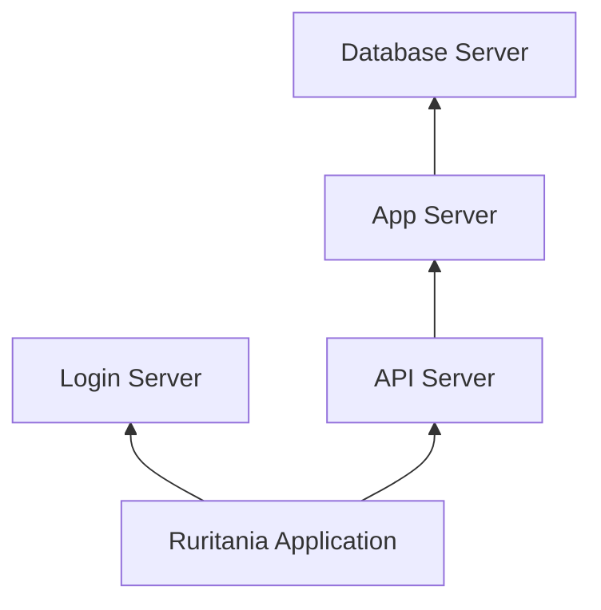

# ITSI POC SE Enablement Lab — Revised Lab Guide

**Version:** 2.9 (21st, July 2026)  
**Authors:** Liam Panizzon and Andrew Riley  
**Scenario:** Ruritania Application monitoring  
**ITSI version:** 4.21.x | **Splunk:** 9.4.x  
**Note:** This guide supersedes the Oct 2025 SE Enablement Lab document. All steps use the **Splunk Web UI only** — no scripts, REST API, or local files required.

## Overview

This lab is based on a fictional application called "Ruritania". This is a public-facing API-driven app. Its health depends on a stack of four backend services:
- API Server — the main public-facing API for engagement with the app
- Login Server — authorization server; login is mandatory before any API transaction
- App Server — holds the business/application logic
- Database Server — stores and serves the app's data (GET/POST requests from the App Server)

By the end, the learner will have a basic understanding of how to independently deploy ITSI: model entities, build a service tree with KPIs, set thresholds and alerts, generate episodes, and deliver a customer-ready glass table demo.

## Lab outcomes

By the end of this lab you will:

1. Model Ruritania application hosts as ITSI entities
2. Build a 5-service dependency tree with KPIs
3. Configure thresholds, alerts, and episodes
4. Build a **Ruritania App Glass Table** single pane of glass
5. Deliver the Exercise 9 demo talk track (optional)

**Estimated time:** 2–3 hours

---

## Before you start

### Access

| Item | Value |
|------|--------|
| Splunk Web UI | URL from your Splunk Show credentials file |
| Username / password | Values from the same credentials file |

Log in and confirm you can open **IT Service Intelligence** from the Apps menu.

---

## Exercise 1 — Explore and verify the environment

**Goal:** Confirm the lab has the apps, content packs, and data that ITSI needs *before* you build anything — so later exercises don't fail on a missing prerequisite. ITSI is only as good as the data and content feeding it, so we check each layer (core apps → modules → content packs → add-on → datagen → entity types) first.

This lab instance ships with most components pre-installed. Use this section to verify them, or to install missing pieces on other environments.

> **Naming note:** Splunk shows **different names** in different places — the **Apps** menu label, the **Manage Apps** page, the **ITSI Content Library** tile, and the **folder name** on disk (`$SPLUNK_HOME/etc/apps/…`) often do not match. Use the table below and look for the **UI label** first.

#### Layer 1 — Core Splunk apps (verify in **Apps** → **Manage Apps**)

| What to look for (UI label) | App folder name | What it does | Required for lab |
|-----------------------------|-----------------|--------------|------------------|
| **IT Service Intelligence** | `itsi` | The core ITSI application — provides Services, KPIs, entities, glass tables, deep dives, and episode management. This is the product the whole lab is built on. | Yes — main ITSI app |
| **ITOA Backend** | `SA-ITOA` | The supporting backend engine for ITSI (IT Operations Analytics). Runs KPI searches, stores service/entity config, and powers the summary indexing behind health scores. Installed automatically with ITSI. | Yes — installed with ITSI (supporting backend) |
| **Splunk Add-on for Unix and Linux** | `Splunk_TA_nix` | A technology add-on (TA) that provides field extractions, sourcetypes, and knowledge objects for Unix/Linux data. Supplies the OS-level context the nix content pack builds on. | Yes — prerequisite for nix content pack |
| **Splunk App for Content Packs** | `DA-ITSI-ContentLibrary` | Delivers the ITSI **Content Library** UI and the catalog of installable content packs (prebuilt entity types, service templates, KPIs, correlation searches, glass tables). | Yes — enables the Content Library UI |
| **ITSI-EDU-rur** | `ITSI-EDU-rur` | The lab's **data generator** — continuously produces the fictional Ruritania application logs in `index=rur_apps` (`rur_api`, `rur_login`, `rur_db`, `rur_submission`) that drive all KPIs and episodes. | Yes on Splunk Show — Ruritania datagen |
| **ITSI-EDU-background** | `ITSI-EDU-background` | Generates supporting "background noise" data (other apps/hosts like `wwwx`, `suppx`, `san`, `ntp`) so the environment feels realistic and reinforces the POC-scoping lesson of filtering to only in-scope hosts. | Optional — demo background assets |

1. Go to: **Apps** → **Manage Apps**


2. In the "filter" search bar, enter the App Folder name:


#### Layer 2 — ITSI modules (bundled; verify in **Manage Apps**)

These ship with ITSI and provide **SAI service templates** (including `OS KPIs - *nix (SAI)` used in Exercise 4). They are **not** the same as content packs.

| What to look for (UI label) | App folder name | What it does | Lab relevance |
|-----------------------------|-----------------|--------------|---------------|
| **ITSI Module for Operating Systems** | `DA-ITSI-OS` | Prebuilt ITSI content for OS monitoring — ships SAI (Smart Analytics Integration) service templates and KPI definitions for CPU, memory, disk, and network health on Windows/Unix hosts. | Provides **OS KPIs - *nix (SAI)** service template |
| **ITSI Module for Application Servers** | `DA-ITSI-APPSERVER` | Prebuilt ITSI content for application-server monitoring (e.g., JVM, web/app tier health) — service templates and KPIs for common app-server platforms. | Optional |
| **ITSI Module for Database Systems** | `DA-ITSI-DATABASE` | Prebuilt ITSI content for database monitoring — service templates and KPIs for database health metrics (connections, query performance, etc.). | Optional |

1. Go to: **Apps** → **Manage Apps**
2. In the "filter" search bar, enter the App Folder Name:


#### Layer 3 — Content packs (install via **ITSI Content Library**, not Manage Apps alone)

A content pack is a prepackaged bundle of ITSI configuration/knowledge objects that gives you working, best-practice monitoring content out of the box so you don't have to build everything by hand. Think of it as a "starter kit" for a specific data source or use case.

Content packs are **not** fully installed when their app folder appears in Manage Apps. Install them from:

1. Go to **APPS** → **ITSI** → **Configuration** → **Data Integrations** → **Content Library**


2. Search for "Unix and Linux" and select "Monitoring Unix and Linux"


3. Click Proceed


4. Leave everything selected as is and click "Install Selected"
5. Do the same for ITSI Monitoring and Alerting by searching "ITSI Monitoring".


6. Once installed you'll see both Content Packs with a green tick.


| Content Library tile name (exact) | App folder (after install) | Required for lab |
|-----------------------------------|----------------------------|------------------|
| **Monitoring Unix and Linux** | `DA-ITSI-CP-nix` | Yes — entity types, `Unix and Linux server health` template |
| **Content Pack for ITSI Monitoring and Alerting** | `DA-ITSI-CP-monitoring-alerting` | Yes — correlation searches & episode policies (Exercise 6) |

> **Auto-installed (no Content Library tile):** **Content Pack for Unix Dashboards and Reports** (`DA-ITSI-CP-unix-dashboards`) installs automatically with the Splunk App for Content Packs. Verify it exists in **Manage Apps** — you do not need to install it separately from the Content Library.

#### Layer 4 — Splunk Add-on for Unix and Linux

You will need to install the Splunk Add-on for Unix and Linux. The Splunk Add-on for Unix and Linux works with the Splunk App for Unix and Linux to provide rapid insights and operational visibility into large-scale Unix and Linux environments.

To install it you'll need to download the App from Splunkbase onto your device: https://splunkbase.splunk.com/app/833


1. Download Splunk Add-on for Unix and Linux from Splunkbase onto your device.


2. Go to **Apps** → **Manage Apps** → **Install app from file**


3. Install App from File and select the Splunk Add-On application on your device. Make sure you tick "Upgrade app. Checking this will overwrite the app if it already exists" and then click **Upload** select "Set up Later" once complete.


4. Finally select, **Setup Later**


#### Layer 5 — Datagen (verify in Search)

1. Go to **Apps** → **Search & Reporting**
2. Run the below SPL with the time picker set to 24 hours:

    ```spl
    | tstats count where index=rur_apps by sourcetype
    ```


3. Or spot-check raw events:

    ```spl
    index=rur_apps | head 10
    ```


#### Layer 6 — Verify entity types from content pack

1. Go to **ITSI** → **Configuration** → **Entity Management**
2. Select **Entity Types**


3. Confirm these exist (created by **Monitoring Unix and Linux** and/or the Unix add-on):

| Entity type title | Source |
|-------------------|--------|
| `*nix` | Content pack / infrastructure monitoring |
| `Unix/Linux Add-on` | Splunk Add-on for Unix and Linux |


You will create **Ruritania Application Server** later.

---

## Reference — Ruritania data model

Keep this table open while you work.

| Topic | Use this |
|-------|----------|
| Application index | `index=rur_apps` |
| Host names | `api-01`, `login-01`, `app-01`, `db-01` |
| In-scope hosts | **14** (4 API, 4 login, 3 app, 3 db) |
| Sourcetypes | `rur_api`, `rur_login`, `rur_db`, `rur_submission` |
| App latency | `sourcetype=rur_submission` |
| Latency fields | `response_time_ms`, `duration_ms`, `processing_time_ms` |
| Errors | `status>=400 OR isnotnull(error)` |
| OS KPIs in demo | **Not populated** for Ruritania hosts |
| Correlation search | `Service Monitoring - KPI Degraded` |
| Service dependencies | Verify in **Service Analyzer** or **Settings → Dependencies** |
| Entity title rules | One prefix per tier (`db*`, `login*`, etc.) |

---

## Exercise 2 — Review data for ITSI relevance

**Goal:** Understand what data drives entities, KPIs, and episodes.

| Data | Where | ITSI use |
|------|-------|----------|
| Transaction logs | `index=rur_apps` | Custom KPIs |
| Hardware metadata | `index=os` sourcetype `hardware_events` | Entity fields |
| KPI summaries | `index=itsi_summary` | Glass table KPI tiles |
| Episodes | `index=itsi_grouped_alerts` | Glass table episode column |

**Inspect a sample event:**

1. Go to **Apps** → **Search & Reporting**
2. Search the below SPL with the time picker set to 24 hours.

    ```spl
    index=rur_apps sourcetype=rur_api | head 1 | table _time host response_time_ms status error
    ```

Note that `status` is numeric (401, 500, 504, etc.) — not the string `ERROR`.

**List in-scope hosts:**

1. Go to **Apps** → **Search & Reporting**
2. Search the below SPL with the time picker set to 24 hours.

    ```spl
    index=rur_apps | stats count by host | sort host
    ```

Expected: `api-01`–`api-04`, `login-01`–`login-04`, `app-01`–`app-03`, `db-01`–`db-03`.

---

## Exercise 3 — Configure entities

**What is an entity and why do I need them?**
An entity is a single thing you monitor in ITSI — usually a host or server (e.g., api-01), along with its identifying fields and metadata.

They connect your raw data to ITSI. Entities let ITSI match incoming events/metrics to the right host, scope services to the correct group of hosts (e.g., API Server → all api* entities), and give you asset context (CPU, region, etc.) when troubleshooting. Without entities, your KPIs and services have nothing to attach to — tiles go grey.

In this lab: the 14 Ruritania hosts (api-01–api-04, login-01–login-04, app-01–app-03, db-01–db-03) are your entities.

**Goal:** Create a Ruritania entity type and assign it to the 14 application hosts.

> **Important:** The lab auto-creates entities from the **Monitoring Unix and Linux** content pack. Your hosts likely **already exist** under entity types such as `*nix`. This exercise **updates** those records — it does not create new ones.

### Step 1 — Create entity type

1. Go to **ITSI** → **Configuration** → **Entity Management**
2. Select **Entity Types**


3. Select **Create Entity Type**
4. **Title:** `Ruritania Application Server`


5. **Save**

### Step 2 — Update existing entities with metadata and entity type

1. Go to **ITSI** → **Configuration** → **Entity Management**
2. Select **Entity**


3. Select **Create Entity** and click "Import from Search"


4. In the Search box enter the below SPL, select 4 hours and click the green search magnify glass:

    ```spl
    index=os sourcetype="hardware_events" [ search index=rur_apps | fields host ] 
    | dedup hostname 
    | eval entity_type="Ruritania Application Server" 
    | rename hostname as Entity_Title, entity_description AS description 
    | table Entity_Title, description, entity_type,platform_type,  cpu_model, cpu_cores, disk_drives, region 
    ```


5. Click **Next**
6. In the Specify columns step, map CSV columns to ITSI fields using the **exact** import labels:

| CSV column | Map to (ITSI import field) |
|------------|----------------------------|
| `Entity_Title` | **Entity title** |
| `description` | **Entity Description** |
| `entity_type` | **Entity Type** |
| `platform_type` | **Entity Informational Field** |
| `cpu_model` | **Entity Informational Field** |
| `cpu_cores` | **Entity Informational Field** |
| `disk_drives` | **Entity Informational Field** |
| `region` | **Entity Informational Field** |


7. Click Import


### Step 3 — Verify entity type and metadata

1. Go to **ITSI** → **Configuration** → **Entity Management**
2. Select **Entity**


3. Confirm **in-scope hosts** by searching: `api-01`–`api-04`, `login-01`–`login-04`, `app-01`–`app-03`, `db-01`–`db-03`

---

## Exercise 4 — Build service maps

A service tree is ITSI's model of how your services depend on each other — a hierarchy showing which services rely on which, so that the health of low-level components rolls up into the health of the overall application.

It answers the question: "If the database is unhealthy, what does that affect?"

**Goal:** Create the service tree, link the nix KPI template, and add latency KPIs.

### Step 1 — Create services manually (in this order)

Create services in dependency order so upstream services exist before you reference them.

**ITSI** → **Configuration** → **Service Monitoring** → **Service and KPI Management** → **Create Service**


For each service below:

> **Note:** Configure the Database Server and Login Server first, as they don't have dependencies.

1. Select **Manually add service content** (do not use a service template or import for this step)
2. Enter **Title** and **Description**


3. Click "Create"
4. Under Entities select **"Add Set of Rules (OR)"**


5. Update the dropdown to **Entity Type** to Ruritania Application Server
6. Add **Add Rule (AND)**
7. Update Alias field to **Entity_Title** and the **Matches** will be the service (see table below):

| Service | Rule 2 — Title matches |
|---------|------------------------|
| Database Server | `db*` |
| Login Server | `login*` |
| App Server | `app*` |
| API Server | `api*` |


8. Click **Save** and then **Save and Enable**


9. **Only required for App Server and API Server:** Select **Service Dependencies** and **Add dependencies** (see table below for the list)


10. Select the dependencies and click Done


11. Complete the remaining wizard steps and **Save and Enable**

| Create order | Service | Dependencies (add during creation) | 
|--------------|---------|-------------------------------------|
| 1 | Database Server | *(none — leave Dependencies empty)* |
| 2 | Login Server | *(none — leave Dependencies empty)* |
| 3 | App Server | Database Server |
| 4 | API Server |  App Server |
| 5 | Ruritania Application | Login Server, API Server |

11. When creating the last service, **Ruritania Application**, you do not need to add the Entities information. However, make sure you add both dependencies:


### Step 2 — Link the OS KPI template

Since these services are running on LINUX hosts, and we have the UNIX Content pack installed, we are going to add the NIX OS KPI template for each of these hosts. Using pre-built service templates saves a lot of time and repetitive work.

1. **ITSI** → **Configuration** → **Service Monitoring** → **Service and KPI Management**
2. For each service (API Server, App Server, Database Server, Login Server) click **Edit** → **Link to Service Template**


3. Pick the OS KPI - *nix(SAI) service template that was provided from the Content Pack


4. Click Link

**Verify Step 1 before continuing** — dependencies save correctly even when they are easy to overlook in the UI:

1. **ITSI** → **Service Analyzer** → **Default Analyzer**
2. Select **"Ruritania Application"** in the Filter Service


3. Click "Tree"


4. Confirm the hierarchy:


5. Then click "Save As" and title it "Ruritania Application"


### Step 3 — Create custom latency KPIs

Now it is time to create the health signals for all the services. We do this by assigning the KPIs to the services.

Each tier service gets its own latency KPI measuring the field that matters for that tier:

| Service | This KPI measures | Field |
|---------|-------------------|-------|
| API Server | API response time | `response_time_ms` |
| Login Server | Login duration | `duration_ms` |
| App Server | App processing time | `processing_time_ms` |
| Database Server | DB query duration | `duration_ms` |

1. Go to **ITSI** → **Configuration** → **Service Monitoring** → **Service and KPI Management**
2. Click on Service (Eg API Server) → **KPIs**


3. Under KPIs select **New** → **Generic KPI**.


4. Fill out the title with the KPI Name from the table below and click **next**


5. Select **Ad-Hoc Search** and paste in the SPL search from the table below. The Threshold Field will be **"value"**.


| Service | KPI name | Search |
|---------|----------|--------|
| API Server | API Response Time | `index=rur_apps host=api* \| stats avg(response_time_ms) as value by host` |
| Login Server | Login Duration | `index=rur_apps host=login* \| stats avg(duration_ms) as value by host` |
| App Server | App Processing Time | `index=rur_apps sourcetype=rur_submission host=app* \| stats avg(processing_time_ms) as value by host` |
| Database Server | DB Query Duration | `index=rur_apps host=db* \| stats avg(duration_ms) as value by host` |


6. Click **Next**
7. Fill out the following setting — **Split and filter by entities**:
    - Enable **entity split**
    - **Entity field:** `host` → **Next**


8. Leave the setting by default and click **next**


9. For Units enter in 'ms' and click **next**


10. Click **Backfill**, **last 7 days** and click **Next**


11. Click **Finish**


12. Click **Save** on the service. Repeat using the table below for each KPI.

> **Critical:** Every search must end with `by host`. Without entity breakdown, KPI tiles stay grey (N/A).

13. Now go back to **Service Analyzer** and you will see all the KPIs now.


---

## Exercise 5 — KPI thresholds, error KPIs, and backfill

**Goal:** Turn raw KPI numbers into meaningful, colour-coded health signals — and give them history so they show up immediately.

Why this matters:
- **Thresholds** tell ITSI when a value is Normal / Warning / Critical, which is what drives the red/amber/green colours and the rolled-up **service health score**. Without them, tiles stay grey (N/A).
- **Error KPIs** (count and rate %) add a *failure* signal alongside latency, so each tier is scored on how slow **and** how broken it is.
- **Backfill** replays the last few days of data so your KPIs and health scores have history right away — instead of waiting for the 5-minute schedule to slowly accumulate points.

### Step 1 — Latency thresholds

For each latency KPI (API Response Time, Login Duration, App Processing Time, DB Query Duration):

1. Go to **ITSI** → **Configuration** → **Service Monitoring** → **Service and KPI Management**
2. Click on Service (Eg API Server) → **KPIs** → **KPI Thresholds**


3. Scroll down and make sure **Static thresholding** is set.


4. Click **Threshold levels** and click **Add threshold**


5. Configure levels:

| Severity | Threshold |
|----------|-----------|
| Low | 400 |
| Medium | 800 |
| High | 1200 |

6. Click **Save** and repeat for all services.
7. Once completed, you can return back to the **Service Analyzer** and you'll see those new KPI thresholds under those KPIs.


#### Advanced options (not used in this lab)

We use **static** thresholds above because this is a short-lived lab. In a real POC with aged data, ITSI offers two ML-driven capabilities worth showing a customer — both require **historical data** we don't have here, so we call them out but don't configure them.

> **Adaptive Thresholding** — instead of fixed values, ITSI **learns** each KPI's thresholds from its history and recalculates them **nightly**, so predictable variation (busy weekdays vs. quiet weekends, day vs. night) doesn't trigger false alerts. Found under **KPI → Thresholds → Adaptive Thresholding**.
> - **Prerequisite:** the **Python for Scientific Computing** add-on and **at least 7 days** of backfilled KPI history (14–30+ days to capture weekly patterns).
> - **Why not in this lab:** the datagen only has ~1–7 days of fairly flat history, so there's no established pattern for the model to learn — static thresholds are the right choice here.
> - **Docs:** [Create adaptive KPI thresholds in ITSI](https://help.splunk.com/en/splunk-it-service-intelligence/splunk-it-service-intelligence/visualize-and-assess-service-health/4.21/advanced-thresholding/create-adaptive-kpi-thresholds-in-itsi)

> **Drift Detection** — watches for **slow, gradual change** in a KPI over weeks or months — the kind of "creep" that adaptive thresholds would silently accept as the new normal (e.g., disk usage steadily climbing until it becomes an outage). It raises a notable event when a KPI drifts beyond a set tolerance so you can act proactively.
> - **Prerequisite:** the **Python for Scientific Computing** add-on and roughly **3 months** of backfilled data.
> - **Why not in this lab:** we don't have anywhere near 3 months of history, so drift can't be demonstrated — but it's a strong proactive-monitoring talking point for customers.
> - **Docs:** [Monitor KPI data drift in ITSI](https://help.splunk.com/en/splunk-it-service-intelligence/splunk-it-service-intelligence/visualize-and-assess-service-health/4.21/create-kpis/monitor-kpi-data-drift-in-itsi)

### Step 2 — Error KPIs

This step adds two more KPIs to each tier service so you're not just tracking speed — you're tracking failures too. Because the demo environment has no OS/nix metrics, these error KPIs (plus latency) become the main health signals on the glass table. Error Count measures how many requests failed per host, and Error Rate % measures what proportion of requests failed — together giving each service three health signals: how slow, how many errors, and what % errors.

On each tier service, create **two** additional KPIs — Error Count and Error Rate %.

On the **Calculation** step, set **Run every:** **5 minutes** for each error KPI.

1. Go to **ITSI** → **Configuration** → **Service Monitoring** → **Service and KPI Management**
2. Click on Service (Eg API Server) → **KPIs**


3. Under KPIs select **New** → **Generic KPI**.


4. Fill out the title (Eg. API Server Error Count) with the KPI Name from the table below and click **next**


5. Select **Ad-Hoc Search** and paste in the SPL search from the table below. The Threshold Field will be "value".


**KPI A — Error Count**

| Service | Error Count search |
|---------|-----------------------------------------------|
| API Server | `index=rur_apps host=api* \| stats count(eval(status>=400 OR isnotnull(error))) as value by host` |
| Login Server | `index=rur_apps host=login* \| stats count(eval(status>=400 OR isnotnull(error))) as value by host` |
| App Server | `index=rur_apps host=app* \| stats count(eval(status>=400 OR isnotnull(error))) as value by host` |
| Database Server | `index=rur_apps host=db* \| stats count(eval(status>=400 OR isnotnull(error))) as value by host` |

6. Click **next**
7. Fill out the following setting — **Split and filter by entities**:
    - Enable **entity split**
    - **Entity field:** `host` → **Next**


8. Update the **Aggregate** to **Sum** and then click **Next**


9. Click **Next**
10. Leave the Unit blank and click **Next**


11. Tick **Back Fill**, select **last 7 days** and click **Finish**


12. Repeat for all services for Error Count.
13. Repeat for all services for Error Rate (see KPI B below).

**KPI B — Error Rate %** (name examples: `API Error Rate %`, etc.)

| Setting | Value |
|---------|--------|
| Entity split | Enabled — field `host` |
| Threshold field | `value` |
| Unit | `%` |
| Run every | **5 minutes** |
| Aggregate / entity stat | Average |

| Service | Error Rate % search |
|---------|---------------------|
| API Server | `index=rur_apps host=api* \| stats count as total count(eval(status>=400 OR isnotnull(error))) as errors by host \| eval value=if(total=0, 0, round(100*errors/total, 2))` |
| Login Server | `index=rur_apps host=login* \| stats count as total count(eval(status>=400 OR isnotnull(error))) as errors by host \| eval value=if(total=0, 0, round(100*errors/total, 2))` |
| App Server | `index=rur_apps host=app* \| stats count as total count(eval(status>=400 OR isnotnull(error))) as errors by host \| eval value=if(total=0, 0, round(100*errors/total, 2))` |
| Database Server | `index=rur_apps host=db* \| stats count as total count(eval(status>=400 OR isnotnull(error))) as errors by host \| eval value=if(total=0, 0, round(100*errors/total, 2))` |

**Suggested error-rate thresholds:** normal &lt; 2, low 2, medium 5, high 10.

**Suggested error-count thresholds:** normal &lt; 50, low 50, medium 150, high 300 (adjust after preview if needed).

### Step 3 — KPI backfill

For **each** custom KPI on all five services:

1. Open the KPI → **Settings** (or service **Settings** tab)
2. Enable **Backfill**
3. Select **Last 7 day**


4. **Save** the service

> Backfill runs in the background. Allow **5–15 minutes** before checking the glass table.

**Pass:** In Search, run (replace with your KPI after it collects):

```spl
index=itsi_summary earliest=-24h
| stats latest(alert_value) as value latest(alert_color) as color count by kpi
| sort kpi
```

Values should be numeric with colour.

---

## Exercise 6 — Alerts and episodes

**Goal:** Generate episodes from KPI degradation and application errors.

Why this matters: on their own, alerts are just a flood of individual notable events. ITSI's **correlation searches** detect the problems (a degraded KPI, or an application error), and **aggregation policies** group the related notable events into a single, actionable **episode** — so an on-call engineer sees "the API service is degraded" instead of hundreds of separate alerts.

### Step 1 — Enable correlation searches

**ITSI** → **Configuration** → **Event Management** → **Correlation Searches**

Enable these built-in searches (use exact names):

- `Service Monitoring - KPI Degraded`
- `Service Monitoring - Sustained KPI Degradation (Recommended)`


### Step 2 — Enable aggregation policies

**Configuration** → **Event Management** → **Noteable Event Aggregation Policies**

Enable:

- **Episodes by Src**
- **Episodes by ITSI Service**


### Step 3 — Create custom correlation search

1. **Configuration** → **Event Management** → **Correlation Searches** → **Create Correlation Search**


2. **Title:** `Ruritania Application Errors`
3. **Search:**

    ```spl
    index=rur_apps (status>=400 OR isnotnull(error))
    | eval service_name=case(
        like(host, "api%"), "API Server",
        like(host, "app%"), "App Server",
        like(host, "login%"), "Login Server",
        like(host, "db%"), "Database Server",
        true(), "Unknown Service")
    ```

4. **Schedule:** every 5 minutes


5. **Notable Event Title**: Ruritania Application Error on %host%
6. **Severity**: **High**


7. **Save** and ensure the search is **Enabled**

> Do **not** use `status=ERROR` — the datagen uses numeric HTTP status codes.

**Test:** After 10–15 minutes:

```spl
index=itsi_grouped_alerts earliest=-1h | stats count
```

returns events.

---

## Exercise 7 — Glass table

**Goal:** Build a simple single-pane "glass table" that shows the health of the Ruritania application and its four tiers at a glance.

> **Keep it simple:** We build this from a **blank** glass table using only **Service Health Score** tiles — no cloning, no deleting sections, and no custom searches. Each service's health score already rolls up the latency and error KPIs you built in Exercises 4–5, so **one tile per service** is enough for a clean single pane of glass.

### Step 1 — Create a new glass table

1. **ITSI** → **Glass Tables** → **Create Glass Table**
2. **Title:** `Ruritania App Glass Table`
3. Choose the **blank** canvas and click **Create**

### Step 2 — Add the overall application health tile

1. In the editor (Click **Edit** top right), add a **Single Value** visualization


3. **Data source** → **KPI** → service **Ruritania Application** → metric **Service Health Score**
4. Place it at the top and make it large. Click on newly created Single Value and give it the **title:** **Ruritania Application**


### Step 3 — Add a health tile for each tier

Add one **Single Value** tile per tier service, each wired to that service's **Service Health Score**. Arrange the four in a row beneath the overall tile so the layout mirrors the service tree.

| Tile label | Service | Metric |
|------------|---------|--------|
| API Server | API Server | Service Health Score |
| Login Server | Login Server | Service Health Score |
| App Server | App Server | Service Health Score |
| Database Server | Database Server | Service Health Score |


### Step 4 — (Optional) Add a latency tile per tier

For a bit more detail, add a second **Single Value** tile under each tier wired to that tier's latency KPI:

| Tier | Latency KPI |
|------|-------------|
| API Server | API Response Time |
| Login Server | Login Duration |
| App Server | App Processing Time |
| Database Server | DB Query Duration |

### Step 5 — Save and verify

1. Click **Save**
2. Set the time range to **Last 4 hours**
3. Confirm every tile shows a **coloured health score** (green / yellow / orange / red) — not grey **N/A**


> If tiles are grey, the KPIs or health scores need data — return to **Exercise 5** (thresholds + backfill) and wait 5–15 minutes.

You now have a clean single pane of glass: overall Ruritania health on top, with each tier's health (and optionally latency) below.

---

## Exercise 8 — Predictive Analytics (advanced / optional)

Train an ITSI machine-learning model to predict the **Ruritania Application** service health score ~30 minutes into the future.

> **⚠️ Data caveat — read first:** ITSI Predictive Analytics trains on **service health-score history** and works best with **~14 days** of data. This lab environment only has the ~1 day you backfilled in Exercise 5, so the model will be **low-confidence** and may warn that there isn't enough history. Treat this exercise as **learning the workflow**, not producing an accurate forecast. In a real POC (or a lab left running for two weeks) the same steps yield meaningful predictions. This is why the Exercise 7 glass table focuses on current health rather than predictive tiles.

### Prerequisites

Predictive Analytics is powered by the **Splunk Machine Learning Toolkit (MLTK)** plus the **Python for Scientific Computing** add-on. On Splunk Show these may already be present — verify first.

| What to look for (UI label) | App folder name | What it does | Required |
|-----------------------------|-----------------|--------------|----------|
| **Splunk Machine Learning Toolkit** | `Splunk_ML_Toolkit` | Provides the ML algorithms and macros ITSI uses to train/test predictive models | Yes |
| **Python for Scientific Computing** (matching your OS) | `Splunk_SA_Scientific_Python_*` | Bundles the Python/numpy/scikit-learn runtime the MLTK depends on | Yes |

Download Splunk Machine Learning ToolKit - https://splunkbase.splunk.com/app/2890 
Python for Scientific Computing is already installed on the instance.

### Step 1 — Verify and share the MLTK

1. Go to: **Apps** → **Manage Apps**


2. Click **"Install App from File"** and select your AI toolkit


3. Click **Restart Now** if prompted.

### Step 2 — Assess whether the service is a good fit

1. **ITSI** → **Configuration** → **Service Monitoring** → **Service and KPI Management**
2. Open the top-level service **Ruritania Application** (it has the aggregate health score that rolls up from all tiers)
3. Open the **Predictive Analytics** tab
4. Set the time period to **Last 14 days** (or the maximum your environment has)
5. Review the historical health-score trend

> In this lab you'll see only ~1 day of history and a mostly flat/green line — that's expected. In a real service you'd look for meaningful variation before modeling.

### Step 3 — Train a model

On the **Predictive Analytics** tab:

1. Configure the **training inputs** — ITSI uses the service's KPIs and health-score history as features
2. Choose an **algorithm type:**
   - **Regression** → predicts a **numeric** health score (0–100). *Use this.* A good default is **Random Forest Regressor**.
   - **Classification** → predicts a health **state** (e.g., Normal/Critical)
3. Select **Random Forest Regressor** under **Algorithm**.
4. Click **Train**


> **Scale note (from ITSI docs):** keep models to services with roughly **≤ 20 KPIs and ≤ 50 entities**. Ruritania is well within this, so training should be quick.

### Step 4 — Evaluate and save the model

1. After training, review the accuracy metrics ITSI reports (e.g., R² / error for regression) on the **test partition**
2. Compare algorithms if you trained more than one, then **select the final model**
3. **Save** the model into the service

> **Expected in this lab:** low accuracy or an "insufficient data" warning. That's the data caveat, not a mistake. Note the metrics and move on.

> **Note:** The model trained successfully, but there's no signal to learn from because your lab health score is flat. In a real, longer-running service where health fluctuates, you'd see a meaningful R² (e.g., 0.7–0.9), a scatter of points, and a worst-case forecast that dips below 100.

---

## Exercise 9 — Demo talk track (optional)

**Goal:** Deliver a 15-minute customer-ready walkthrough.

| Step | Navigate to | Talking point |
|------|-------------|---------------|
| 1 | **Ruritania App Glass Table** | Single pane of glass — tier health, latency, errors |
| 2 | Click **API Server** health tile → **Deep Dive** | Drill from symptom to KPI trend |
| 3 | **Service Analyzer** | Dependency tree; impact rolls up to Ruritania Application |
| 4 | Select entity **api-01** | Tie KPIs to a specific host and asset metadata |
| 5 | **Event Analytics → Episodes** | Correlated errors grouped by service |
| 6 | Open an episode | Connect episode → service → KPI threshold breach |

### Demo readiness checklist

- [ ] Glass table tiles show color (not mostly grey N/A)
- [ ] At least one KPI in warning or critical state
- [ ] Service Analyzer shows all 5 services with dependencies
- [ ] Deep Dive opens for API Response Time
- [ ] Episodes view shows recent grouped alerts

---

## Troubleshooting (GUI-only)

| Symptom | Likely cause | What to do |
|---------|--------------|------------|
| Grey N/A KPI tiles | Thresholds not set | Exercise 5 → Thresholds tab on each KPI |
| Grey N/A KPI tiles | Search missing `by host` | Edit KPI → add `by host` to search |
| CPU / disk tiles empty | No nix metrics in demo | Use error count/rate KPIs on glass table instead |
| Glass table save error | Orphan visualizations | Delete tiles only in Glass Table editor; avoid raw JSON edits |
| Episodes always 0 | Correlation uses `status=ERROR` | Update search to `status>=400 OR isnotnull(error)` |
| Hourly errors show 0 | Search uses `itsi_tracked_alerts` only | Use `rur_apps` ad hoc search from Exercise 7 |
| Hourly episodes show 0 | Correlation not run yet | Wait 15 min; confirm Exercise 6 searches enabled |
| No backfill data | Backfill not saved | Re-open service → Settings → enable backfill → Save |
| Wrong hosts on service | Entity rules incorrect | Verify entity type + title prefix rules match Exercise 4 |

### Validation searches (Search app)

```spl
index=itsi_summary earliest=-4h | stats count by service_name kpi | sort service_name
index=itsi_grouped_alerts earliest=-4h | stats dc(itsi_group_id)
index=rur_apps (status>=400 OR isnotnull(error)) earliest=-1h | stats count by host
```

---

## Appendix A — Service dependency diagram



---

## Appendix B — KPI quick reference

| Tier | Latency KPI | Error count search prefix | Error rate search prefix |
|------|-------------|---------------------------|--------------------------|
| API | `host=api*` → `response_time_ms` | `host=api*` | `host=api*` |
| Login | `host=login*` → `duration_ms` | `host=login*` | `host=login*` |
| App | `sourcetype=rur_submission host=app*` → `processing_time_ms` | `host=app*` | `host=app*` |
| Database | `host=db*` → `duration_ms` | `host=db*` | `host=db*` |

All searches use `index=rur_apps` and end with `by host` for entity breakdown.

---

## Appendix C — Changes from Oct 2025 guide

| # | Original issue | This guide |
|---|----------------|------------|
| 1 | `index=rur_applications` | `index=rur_apps` |
| 2 | ~20 entities | 14 in-scope hosts |
| 3 | API episodes used `entity_name=app*` | Use `api*`, `login*`, `app*`, `db*` per row |
| 4 | Required external CSV/glass table files | All steps in UI; optional Search export for entities |
| 5 | Glass table wired to OS KPIs | Simple glass table built from Service Health Score tiles (health rolls up latency + error KPIs; no nix metrics needed) |
| 6 | `status=ERROR` in correlation search | `status>=400 OR isnotnull(error)` |
| 7 | KPI searches without `by host` | All KPI searches include entity breakdown |
| 8 | No threshold or backfill steps | Exercise 5 — required for populated tiles |
| 9 | Glass table JSON orphan error | Delete tiles in visual editor only |
| 10 | App KPI missing sourcetype | `sourcetype=rur_submission` for app tier |
| 11 | Wrong content pack / module names | See **Exercise 1** naming table |
| 12 | Content packs listed as Manage Apps only | Install from **Configuration → Data Integrations → Content Library** |
| 13 | Import new entities in entity step | **Update existing entities** by Entity Title; map description/type to dedicated fields |
| 14 | Dependencies look missing on Services list | Verify in **Service Analyzer** or **Settings → Dependencies** — tree may not show on list view |
| 15 | Same title rule on all tier services | Use **one prefix per service** (`db*`, `login*`, `app*`, `api*`) — not `db*,app*,login*,api*` everywhere |
| 16 | Exercise 4 KPI type | **Generic KPI** → **Ad hoc Search**; **Calculation** → **Run every: 5 minutes** |

---

## Appendix D — Document history

| Version | Date | Notes |
|---------|------|-------|
| 1.0 | Oct 2025 | Original SE Enablement Lab Guide |
| 2.0 | Jul 2026 | Validated against Splunk Show ITSI 4.21 |
| 2.1 | Jul 2026 | GUI-only revision |
| 2.2 | Jul 2026 | Correct ITSI/content pack naming; screenshot placeholders for Exercise 1 |
| 2.3 | Jul 2026 | Exercise 3 entity import — update existing, correct field mappings |
| 2.4 | Jul 2026 | Exercise 4 — Manually add service content; dependencies in creation wizard |
| 2.5 | Jul 2026 | Exercise 4 — dependency verification steps; tier-specific entity title rules |
| 2.6 | Jul 2026 | Exercise 4/5 KPI wizard — Generic KPI, ad hoc search, 5-minute calculation |
| 2.7 | Jul 2026 | Consolidated repo; fixed KPI validation search (`kpi` not `kpiid`); 7-day backfill |
| 2.8 | Jul 2026 | Formatting cleanup — renumbered exercises; fixed headings, list numbering, tables |
| 2.9 | Jul 2026 | Screenshots now render as indented continuations of their step (numbering counts actions only, images align with the step they illustrate) |
